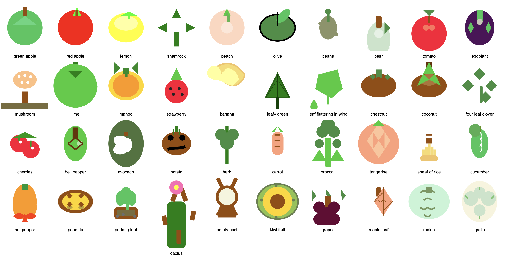

# LLaMojis



LLaMojis uses LLaMa 3.1 405B to generate an SVG for each emoji in the emoji set.  

We use [twemoji](https://github.com/twitter/twemoji) in this project. 

```
git clone https://github.com/twitter/twemoji
```

The emojis are found in `twemoji/assets/svg/`. 

Information about emojis comes from [emojibase](https://github.com/milesj/emojibase) and is accessed through [this json file](https://github.com/milesj/emojibase/blob/master/packages/data/en/data.raw.json), this is where `emojidata.json` is from. `emojiall.txt` is just the labels from `emojidata.json`. 

