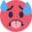

# LLaMojis

## Emoji set recreated with LLaMa

Food emojis. See the full set [here](https://llamathon-svgenerator.onrender.com/LLaMojis.html) 

LLaMojis uses LLaMa 3.1 405B to generate an SVG for each emoji in the emoji set.  

## LLaMoji guessing game 
Guess which prompt we used to create the LLaMoji!
<div style="display: flex; flex-wrap: wrap; gap: 10px; justify-content: center;">
    
    
</div>


## Twemoji animated with LLaMa
<div style="display: flex; flex-wrap: wrap; gap: 10px; justify-content: center;">
    
    
    
    
    
    
    
    
    
    
    
    
    
    
    
    
    
    
    
    
    
    
    
    
    
    
    
</div>

## Twemoji animated with Claude
<div style="display: flex; flex-wrap: wrap; gap: 10px; justify-content: center;">
    
    
    
    
</div>


## Background and setup 
We use [twemoji](https://github.com/twitter/twemoji) in this project. 

```
git clone https://github.com/twitter/twemoji
```

The emojis are found in `twemoji/assets/svg/`. 

Information about emojis comes from [emojibase](https://github.com/milesj/emojibase) and is accessed through [this json file](https://github.com/milesj/emojibase/blob/master/packages/data/en/data.raw.json), this is where `emojidata.json` is from. `emojiall.txt` is just the labels from `emojidata.json`. 

